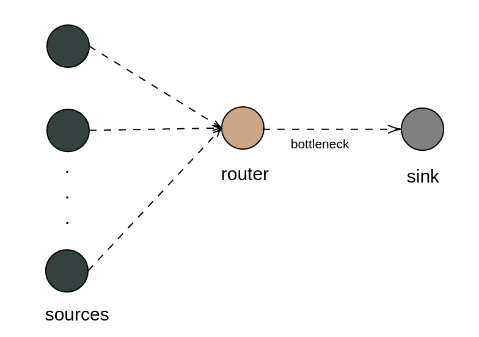
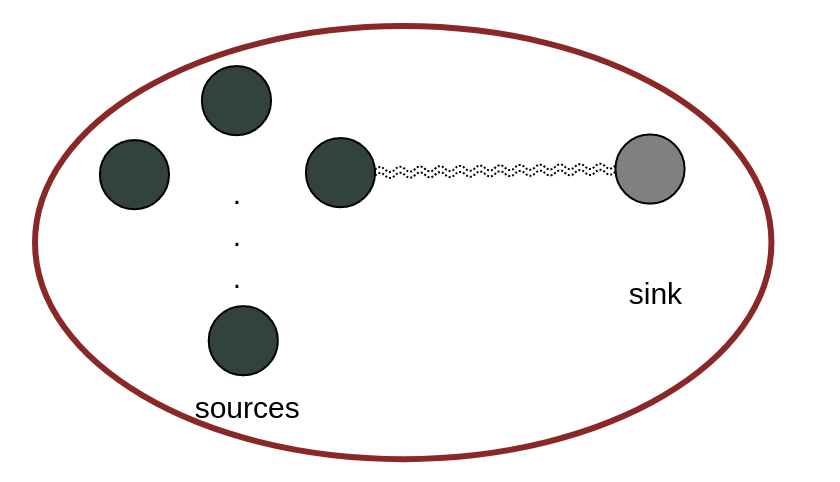
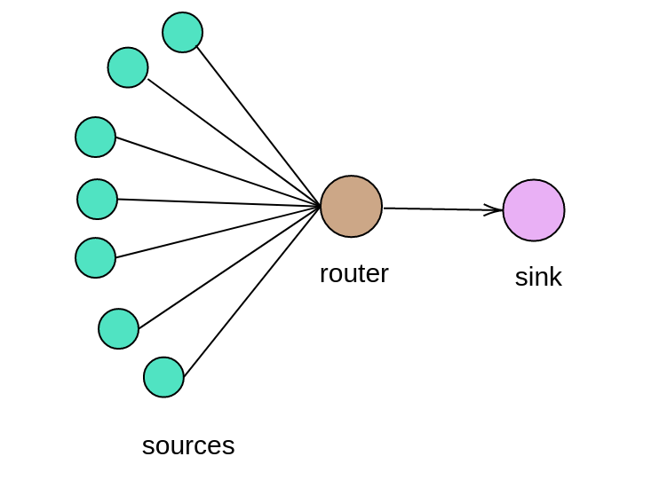
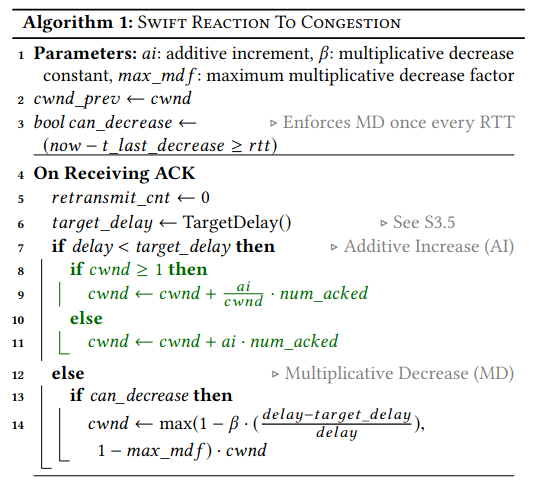
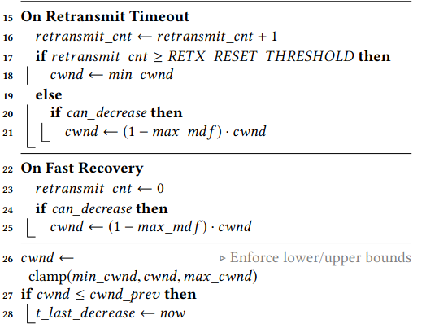
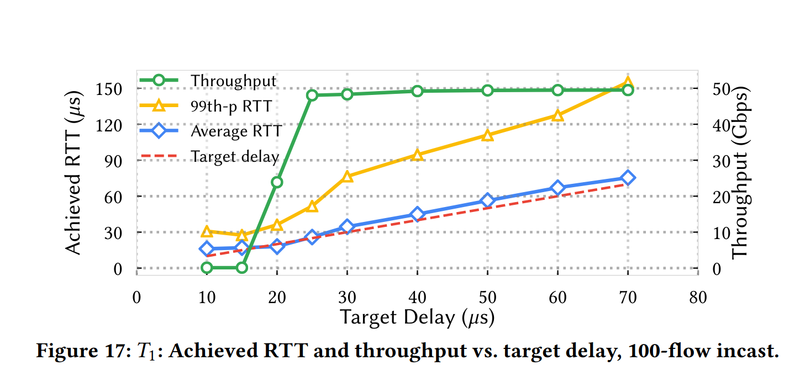
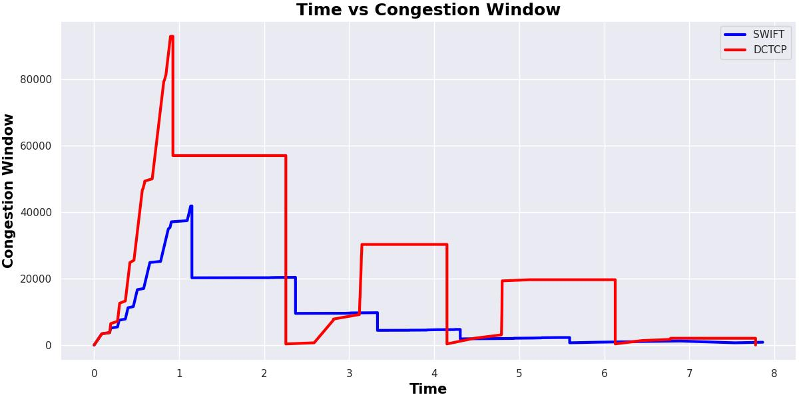
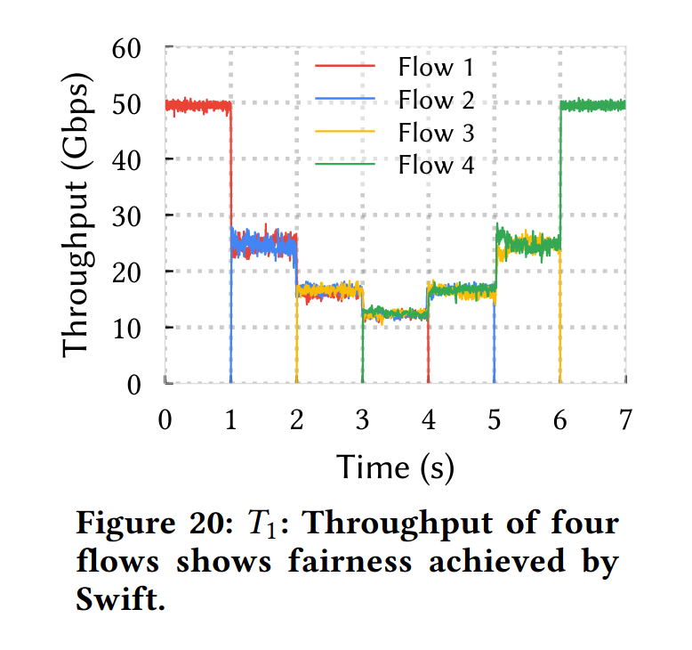

# A Comparative Study on Performance of Different Congestion Control Algorithms
```
Supervisor: 
Syed Md. Mukit Rashid
Lecturer, Dept. of CSE
Bangladesh University of Engineering and Technology
```

## Contents

- 1 Introduction
- 2 Network Topologies Under Simulation
   - 2.1 Task A1 - Wired topology
   - 2.2 Task A2 - Wireless low-rate (802.15.4, static)
   - 2.3 Task B - Topology for Data Centers
- 3 Parameters Under Variation
- 4 Overview of the Proposed Algorithm
- 5 Modifications Made in the Simulator
   - 5.1 Variables
   - 5.2 Functions
- 6 Results with Graphs
   - 6.1 Task A1 - Wired Topology
   - 6.2 Task A2 - Wireless Low Rate Static Topology
   - 6.3 Task B - Modified Algorithm
      - 6.3.1 Required Two Metrics
      - 6.3.2 Additional Study
- 7 Summary Findings
   - 7.1 Task A1 - Wired
   - 7.2 Task A2 - Wireless
   - 7.3 Task B - Modified Algorithm


## 1 Introduction

This report briefly discusses the varied network parameters
and performance metrics of two built-in and one implemented
congestion control algorithms, with three different network topolo-
gies simulated.

## 2 Network Topologies Under Simulation

Two different topologies were simulated for task-A, one wired
and one wireless low rate static. For task-B, a suitable topology
for data centers was used.

### 2.1 Task A1 - Wired topology


<p align="center">
  
  <br>
  <em>Figure1 : Wired Topology</em>
</p>


In this topology, we have n number of sources, one gateway
and one sink. All nodes have point to point wired connections


between them. After creating point to point channels between
each pair of nodes, the data rate and delay value of the channel
were set to 2Mbps and 0.01ms. A rate-error model was installed
on the devices to simulate error on the network and the error
rate was set to be 0.01%. Then FIFO-queues were installed on
the devices. Finally individual ipv4 networks were created for
each wired connection.
Two congestion control algorithms - TcpNewReno and Tcp-
Westwood were tested on this topology.


### 2.2 Task A2 - Wireless low-rate (802.15.4, static)


This topology was created using low rate PAN devices (wifi
<p align="center">
  
  <br>
  <em>Figure2 : Wireless Topology (Low Rate Static)</em>
</p>
standard 802.15.4) in a static wireless IPv6 network. There are
n number of sources and one sink.
After creating the nodes, the mobility model was used to set
the position of the nodes in a square shaped grid. The coverage
area of the grid was varied. For creating static nodes, constant
position mobility model was used. The maximum transmission
range of the nodes was set to be 80 meters using range propa-
gation loss model.
The low rate PAN devices were created using LrWpanHelper.
Finally, an ipv6 network was installed on all the nodes.
Both congestion control algorithms for task A1 were also applied
and tested on this topology.


### 2.3 Task B - Topology for Data Centers

This topology was inspired from the topology provided in [1]
(Alizadeh et al., 2010) for data centers. This is a fully wired
topology simulated with a lot of flows. The steps to create this
topology is similar to Task-A1 topology. Two congestion control
algorithms were tested on this topology - TcpDctcp, a popular
congestion control algorithm for data centers, and TcpSwift, an
algorithm implemented in NS3 in this study. The algorithm
was inspired from the algorithm presented in [2] (Kumar et al.,
2020).


<p align="center">
  
  <br>
  <em>Figure3: Wired Topology Suitable for Data Centers</em>
</p>

## 3 Parameters Under Variation

The following parameters were varied to analyze performance
metrics. Here Txrange = 20 and Maxrange = 80.

| nodes | flows | packets |
|---------|---------|--------------------------------------|
| 20      | 10      | 100                                  | 1*Tx\_range |
| 40      | 20      | 200                                  | 2*Tx\_range |
| 60      | 30      | 300                                  | 3*Tx\_range |
| 80      | 40      | 400                                  | 4*Tx\_range |
| 100     | 60      | 500                                  | 5*Tx\_range |


## 4 Overview of the Proposed Algorithm

The algorithm, Swift, proposed in this study was inspired from
[2] (Kumar et al., 2020). Swift uses delay as the primary con-
gestion signal. The accurate measurement of delay can result in
a high performing congestion control algorithm. Swift was de-
signed for data centers which are prone to extreme congestion.
The DCTCP algorithm [1] is standard for congestion control in
data centers. Swift was tested in Google datacenters and it per-
formed much better than DCTCP, with near-zero packet drops,
while sustaining 100Gbps throughput per server. Following is
the pseudocode of the algorithm :

<p align="center">
  
  <br>
</p>

<p align="center">
  
  <br>
  <em>Figure4: Pseudocode of Swift</em>
</p>


## 5 Modifications Made in the Simulator

- New Files : The following files/classes were added to incorporate Swift :

       - tcp-swift.cc
  
       - tcp-swift.h

       - class TcpSwiftRecovery in tcp-recovery.ops.cc


All of these additions were done to the internet module.
The wscript file of the module had to be modified to introduce the additions.

- Modified Files: The following files/classes were modified to incorporate Swift :
  
         - tcp-socket-state.cc, tcp-socket-state.h
  
         - tcp-socket-base.cc

### 5.1 Variables


The following variables were needed to implement Swift. They
were added to TcpSocketState class in the tcp-socket-state files.

- bool m canDecrease- for deciding when the congestion
    window can decrease
- uint32 t retransmit count - to trigger recovery algo-
    rithm
- uint32 t m gamma - multiplicative decrease parameter
    (maxmdf), initial value was set to be 1
- uint32 t max cwnd- A parameter to control maximum
    congestion window, initial value was set to be nearest seg-
    ment size of 20000


- uint32 t min cwnd - A parameter to control minimum
    congestion window, initial value was set to be nearest seg-
    ment size of 500

The following variables were added to TcpSwift class in tcp-swift
files.

- uint32 t m alpha- additive increment (ai), initial value
    was set to be 2
- uint32 t m beta- multiplicative decrease constant, initial
    value was set to be 4

### 5.2 Functions

- TcpSwift:
    - **PktsAcked**
  
       This function is triggered when a packet is acknowl-
       edged. In this function the retransmit count was set to
       be zero. Also the minimum and base round trip time
       were updated.
    - **IncreaseWindow**
  
       The congestion window was adjusted based on differ-
       ent conditions, following the Swift algorithm. When
       congestion window is less than slow start threshold, we
       follow the slow start method of New Reno algorithm.
       When it reaches the threshold, we move on to conges-
       tion avoidance phase by adjusting the congestion win-
       dow. Here we use delay as a threshold.
       If rtt is less than target delay, we get the congestion
       window in segments and do the following :

            ∗ if congestion window is greater than one segment
                size,
                    cwnd=cwnd+α/cwnd∗segmentsAcked
            ∗ else,
                cwnd=cwnd+α∗segmentsAcked

        If rtt is not less than target delay, we check if the can
        decrease boolean value has been set to true. If it is, we
        do the following :

            value1 = 1−β∗(delay−targetDelay)/delay

            value2 = 1−gamma

            cwnd=max(value 1 ,value2)∗cwnd

    - **TargetDelay**

        Since the values of the parameters used in the target
        delay function of the paper [2] were not defined clearly,
        a placeholder value was used in this function to be fine
        tuned later. From the following plot of [2](Kumar et al.,
        2020), we set the target delay to be 25 microseconds.

        <p align="center">
        
        <br>
        <em>Figure 5: Target Delay vs Throughput</em>
        </p>

- **TcpSocketBase**:
    - ReTxTimeout

        This function is triggered when a retransmit timeout
        event occurs. We increment the retransmit count here.
        If it is greater than retransmit threshold (retxThresh-
        old), the congestion window is set to be the minimum
        value defined by us. Else, if the boolean canDecrease
        is set, we do multiplicative decrease :
        ```
        cwnd= (1−gamma)∗cwnd
        ```

- **TcpSwiftRecovery**:
    - Enter Recovery

       In this function we set the retrasmit count to be zero.
       Then, if the boolean canDecrease is set, we do multiplicative decrease :

        ```
        cwnd= (1−gamma)∗cwnd
        ```

    Then we apply the clamp function on the congestion
    window and if it decreases from the previous congestion
    window, we set the time of last decrease to the current
    time.

  - **TcpSocketState**:

      - Clamp

        This function sets and upper and lower bound on the
        congestion window.


## 6 Results with Graphs

For each task, the following metrics were calculated using the
help of flow monitor.

- **Network throughput (Kbps)**

    The network throughput was calculated for each flow with
    the following formula -

    ```
    (receivedBytes× 8)/((TimeofLastReceivedPacket−TimeofFirstSentPacket)*1024)
    ```
    The throughput was summed for each flow then finally it
    was divided with the number of flows to get the average
    throughput.

- **End-to-end delay**
  
    The end to end delay for each received
    packet of the network was summed and then divided with
    total received packets. The unit is nanoseconds.
       ```

       EndtoEndDelaySum/ReceivedPackets
- **Packet delivery ratio**
  
    ReceivedPackets× 100/ SentPackets

- **Packet drop ratio**
  
    LostPackets× 100/ SentPackets


### 6.1 Task A1 - Wired Topology

Figure 6 describes the performance metrics of two congestion
control algorithms - TcpWestwood and TcpNewReno against
varied number of flows in each simulation. Here number of nodes
= 40 and packets per second = 400.

<p align="center">

<br>
</p>
<p align="center">

<br>
</p>
<p align="center">

<br>
</p>
<p align="center">

<br>
<em>Figure 6: Flow vs Metrics</em>
</p>


Figure 7 describes the performance metrics against varied
number of nodes in each simulation. Here number of flows = 80
and packets per second = 400.

<p align="center">

<br>
</p>
<p align="center">

<br>
</p>
<p align="center">

<br>
</p>
<p align="center">

<br>
<em>Figure 7: Nodes vs Metrics</em>
</p>

Figure 8 describes the performance metrics against varied
number of packets per second in each simulation. Here number
of flows = 80 and nodes = 40.

<p align="center">

<br>
</p>
<p align="center">

<br>
</p>
<p align="center">

<br>
</p>
<p align="center">

<br>
<em>Figure 8: Packets Per Second vs Metrics</em>
</p>

### 6.2 Task A2 - Wireless Low Rate Static Topology

Figure 9 describes the performance metrics of two congestion
control algorithms - TcpWestwood and TcpNewReno against
varied number of flows in each simulation. Here number of nodes
= 40 and packets per second = 400.

<p align="center">

<br>
</p>
<p align="center">

<br>
</p>
<p align="center">

<br>
</p>
<p align="center">

<br>
<em>Figure 9: Flow vs Metrics</em>
</p>

Figure 10 describes the performance metrics against varied
number of nodes in each simulation. Here number of flows = 80
and packets per second = 400.

<p align="center">

<br>
</p>
<p align="center">

<br>
</p>
<p align="center">

<br>
</p>
<p align="center">

<br>
<em>Figure 10: Nodes vs Metrics</em>
</p>

Figure 11 describes the performance metrics against varied
number of packets per second in each simulation. Here number
of flows = 80 and nodes = 40.

<p align="center">

<br>
</p>
<p align="center">

<br>
</p>
<p align="center">

<br>
</p>
<p align="center">

<br>
<em>Figure 11: Packets Per Second vs Metrics</em>
</p>

Figure 12 describes the performance metrics against varied
coverage area in each simulation. Here number of flows = 80,
nodes = 40, packets per second = 400 and Max range = 80
meters.

<p align="center">

<br>
</p>
<p align="center">

<br>
</p>
<p align="center">

<br>
</p>
<p align="center">

<br>
<em>Figure 12: Coverage Area vs Metrics</em>
</p>

### 6.3 Task B - Modified Algorithm

#### 6.3.1 Required Two Metrics

Figure 13 and 14 describes the performance metrics implemented
algorithm TcpSwift and standard algorithm DCTCP. In [2] it
was claimed that Swift achieves loss rates that are atleast 10x
less than that of DCTCP while maintaining equal throughput.
So we look at the metrics packet drop ratio and average through-
put by varying different parameters.

<p align="center">

<br>
</p>
<p align="center">

<br>
</p>
<p align="center">

<br>
<em>Figure 13: Parameters vs Packet Drop Ratio</em>
</p>

<p align="center">

<br>
</p>
<p align="center">

<br>
</p>
<p align="center">

<br>
<em>Figure 14: Parameters vs Average Throughput(Kbps)</em>
</p>


#### 6.3.2 Additional Study

The following plot shows the congestion window of Swift and
Dctcp. This plot implies the correctness in implementation of
Swift algorithm.
<p align="center">

<br>
<em>Figure 15: Comparison of congestion window of TcpDctcp and TcpSwift</em>
</p>


Figure 16 shows fairness achieved by Swift. Here the figure
in the left has been taken from (Kumar et al., 2020) [2]. Since
simulating Gbps level throughput is unachievable by point to
point link of NS3, the throughput has been shown in Kbps range.

<p align="center">

<br>
</p>
<p align="center">

<br>
<em>Figure 16: Throughput of individual flows of Swift</em>
</p>


Following figure shows a comparison between throughput and
lost packets of TcpDctcp and TcpSwift.

<p align="center">

<br>
</p>
<p align="center">

<br>
<em>Figure 17: Comparison of performance of TcpDctcp and TcpSwift by individual flows</em>
</p>


## 7 Summary Findings

### 7.1 Task A1 - Wired


### 7.2 Task A2 - Wireless

Analysis on wireless topology revealed that Westwood performs
better in wireless networks that wired networks. Further analy-
sis is described on following table.

<p align="center">

<br>
</p>


### 7.3 Task B - Modified Algorithm

The plots generated clearly shows that TcpSwift achieves much
lower packet loss rates while maintaining similar throughput to
TcpDctcp, validating the claim made in the paper. The exact
results described in the paper could not be reproduced because
of missing data of various parameters of the paper. More time
and fine tuning may result in much better performance of the
algorithm. Another issue was the limitation of point to point
connections of NS3 in simulating Gbps level data rate. Because
of that the exact scenario of a data center could not be depicted
in the simulation.

<p align="center">

<br>
</p>

## References

```
[1] Alizadeh, M., Greenberg, A., Maltz, D., Padhye, J., Patel, P., Prabhakar, B., Sen-
gupta, S. and Sridharan, M., 2010.Data center TCP (DCTCP). ACM SIGCOMM
Computer Communication Review, 40(4), pp.63-74.
[2] Kumar, G., Dukkipati, N., Jang, K., Wassel, H., Wu, X., Montazeri, B., Wang, Y.,
Springborn, K., Alfeld, C., Ryan, M., Wetherall, D. and Vahdat, A., 2020.Swift. Pro-
ceedings of the Annual conference of the ACM Special Interest Group on Data Com-
munication on the applications, technologies, architectures, and protocols for computer
communication,.
```

